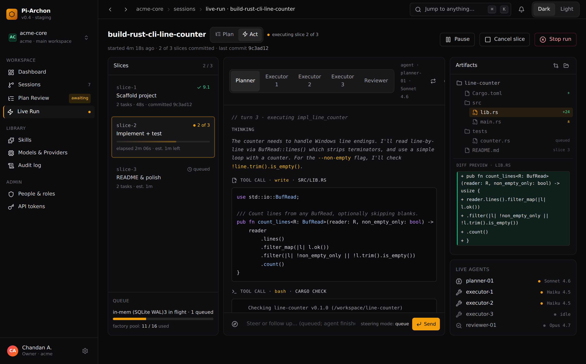
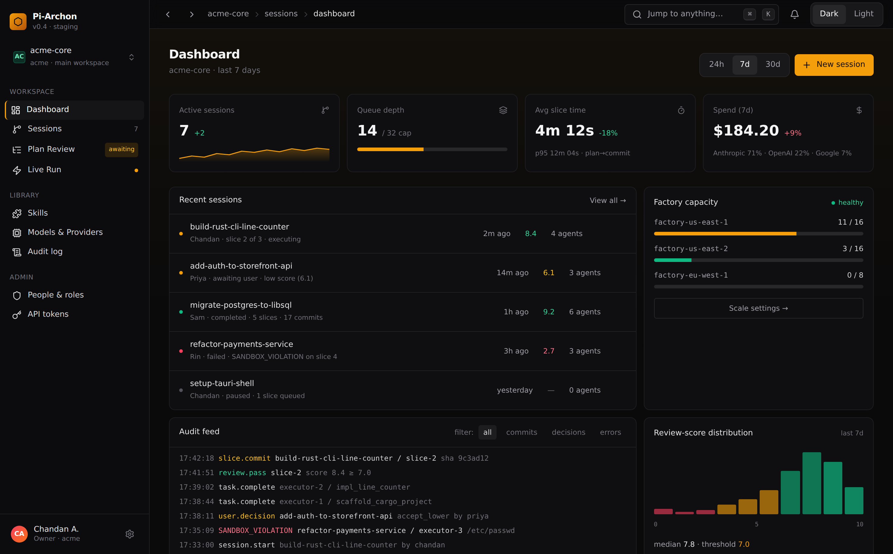
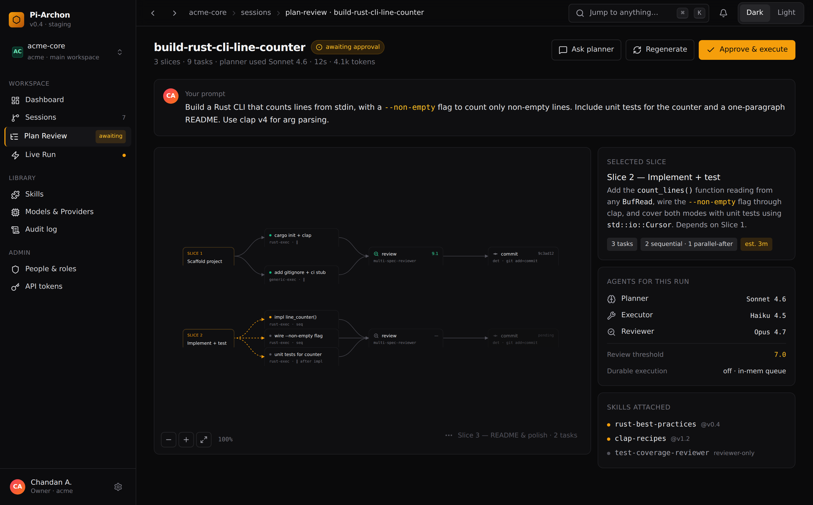
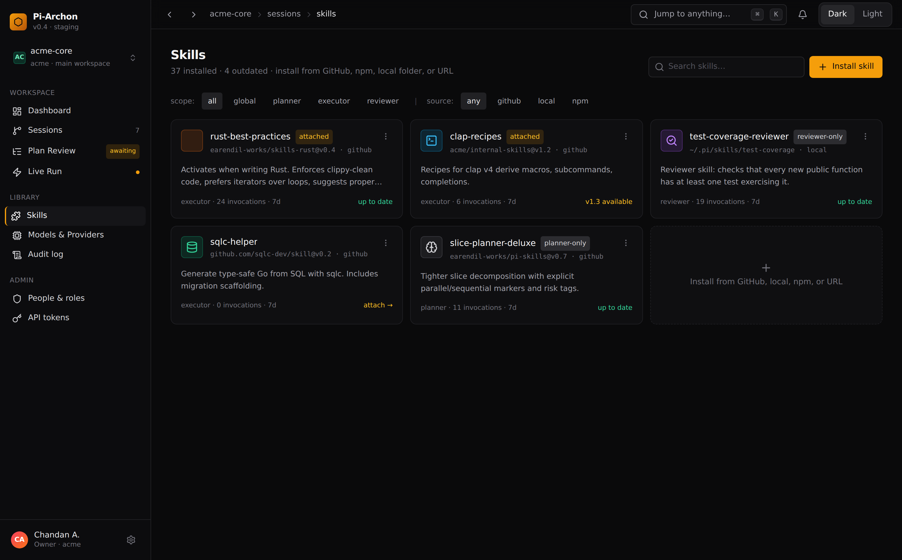
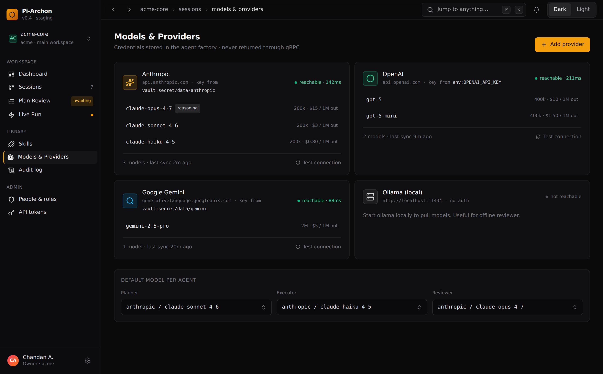
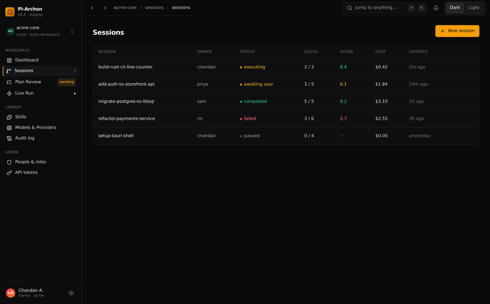
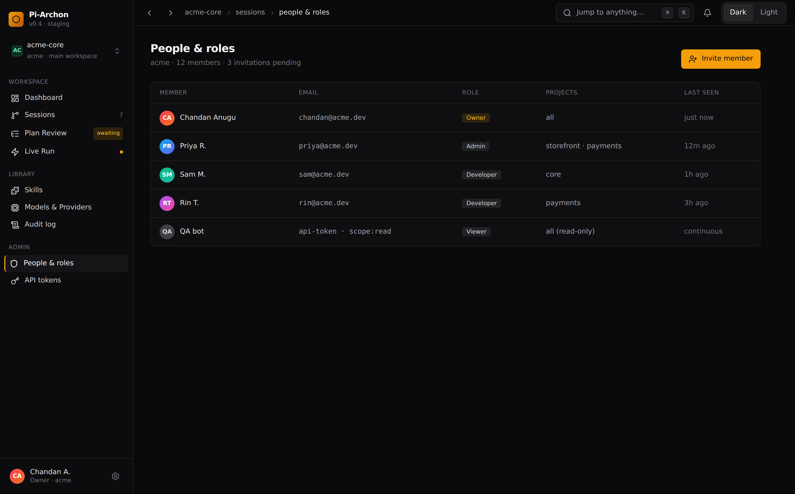
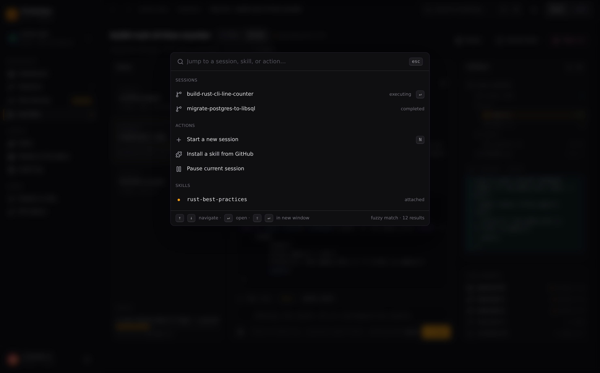

# 03 — Tauri Desktop UI (SvelteKit)

**Path:** `apps/desktop/`
**Stack:** Tauri 2.9, Rust 1.88, SvelteKit 2 (Svelte 5 runes), Vite 6, Tailwind v4, shadcn-svelte, Motion (formerly Framer Motion) for animations, Lucide icons, gRPC-Web via `@bufbuild/connect-web`.

The UI is a **thin client** to the remote orchestrator. No backend logic. No embedded sidecars. The Rust shell exists only for OS integration (file picker, keychain, deep-link handler, native menus).

---

## 1. Design principles

- **Dark-first neutral palette** — `zinc`/`stone` base, single warm accent (configurable), no rainbow gradients.
- **Linear / Raycast aesthetic** — tight spacing, generous whitespace inside cards, monospace for code/IDs only.
- **Animation discipline** — Motion's `animate` for layout transitions, spring physics for drag, `whileHover`/`whileTap` for affordance, never gratuitous.
- **Information density without text-vomit** — icons + tooltips, hover-reveal detail, command palette for power users.
- **One primary action per view.** Secondary actions in overflow menu.
- **Empty states with personality, never "no data."**

Expanded design tokens, component patterns, and motion presets live in `05-design-system.md`.

---

## 2. Screens

The table below is the inventory. Each entry is rendered in the prototype at [`../prototypes/ui-end-state.html`](../prototypes/ui-end-state.html); full-resolution PNGs live in [`../prototypes/screens/`](../prototypes/screens/). The renderings below are the visual contract — anything we ship needs to look at least this considered.

| Screen | Purpose | Key components |
|---|---|---|
| **Onboarding** | First-run: enter orchestrator URL (always remote — self-hosted or SaaS), sign in via password/OIDC, save server profile. Multiple server profiles supported (switch between dev/staging/prod). | Stepper, OIDC redirect, server-profile picker, TLS-cert trust prompt. |
| **Workspaces** | List user's projects/workspaces, create new. | Grid cards, recent activity sparklines. |
| **New Session** | Pick workspace dir, doc base, planner/executor/reviewer models, review threshold, durable toggle, default skills. | Multi-step form, model picker with cost/context badges. |
| **Plan Review** | Inspect generated plan: slices, tasks, parallel/sequential markers; edit; approve. | DAG visualization (Codemaps-inspired), inline edit, comment threads. |
| **Live Run** | Watch slice progression, agent streams, artifact tree, queue depth. | Three-pane (slice list · agent stream · artifact tree), live tokens, virtualized log. |
| **Review Verdict** | Reviewer score, notes, diff against pre-slice baseline. | Side-by-side diff (Plandex-style), accept/reject controls. |
| **Skills** | Browse, install (GitHub/local/url/npm), attach to agent kinds, version pin. | Marketplace grid, install drawer, per-agent scope chips. |
| **Models & Providers** | Configure providers, auth, default models per agent kind. | Provider cards, secret refs (never plaintext shown), test-connection. |
| **Dashboard** | Org-level: active sessions, queue health, factory capacity, cost rollup, audit log feed. | KPI tiles, time-series, audit table with filters. |
| **Admin** | Users, roles, projects, API tokens, OIDC config. | RBAC matrix, invite flow. |
| **Settings** | App theme, accent color, keyboard shortcuts, telemetry opt-out. | — |
| **Command palette (⌘K)** | Jump to any session/skill/setting, run actions. | Fuzzy search, recents. |

---

### 2.1 Live Run — the showpiece

Three-pane: slices on the left, the active agent's stream (thinking → tool calls → code → command output → next turn) in the middle, artifacts and live agent panel on the right. Plan/Act toggle pill in the header. Shimmer progress on the in-progress slice. Live caret blink in the token stream. Steering composer at the bottom of the stream pane.



### 2.2 Dashboard

KPI tiles with sparklines (active sessions, queue depth, avg slice time, spend) above a recent-sessions table, factory capacity gauge, audit feed, and review-score histogram.



### 2.3 Plan Review

User prompt card at the top. The plan as a DAG on a dotted-grid Codemap canvas with animated dashed edges on the active path. Right-rail side panel for the selected slice, agents in play, attached skills, and the prominent Approve & Execute primary action.



### 2.4 Skills

Marketplace cards with provenance line (`github:` / `local:` / `npm:`), scope chips (`attached`, `planner-only`, `reviewer-only`), invocation count over the window, and an "install from anywhere" CTA card.



### 2.5 Models & Providers

Provider cards with reachability + latency, model rows showing context window and per-1M-token output cost. Defaults-per-agent picker at the bottom.



### 2.6 Sessions

Dense table view with status pill, slices progress, score, cost, owner, last-updated.



### 2.7 People & roles

RBAC matrix: members, emails (or `api-token · scope:read` for machine identities), role chip, scoped projects, last-seen.



### 2.8 Command palette (⌘K)

Fuzzy search across sessions, skills, and actions. Keyboard hints in the footer. Available on every screen.



---

## 3. UX details borrowed from competitors

- **Cline-style Plan/Act toggle** at the top of the Live Run screen ("Currently in Plan mode" / "Currently executing").
- **Plandex-style cumulative diff** with rewind to any slice boundary.
- **Windsurf-style Codemap** — DAG view of the plan with slice nodes, task nodes, agent assignments, color-coded status.
- **Claude Code skill marketplace** — install-from-GitHub one-click with version pin and verify-signature option (future).
- **Linear-style breadcrumbs + ⌘K command palette** for navigation.
- **Raycast-style sub-action menus** on every row.

---

## 4. Real-time updates

- Single gRPC server-stream subscription per open session (`StreamSessionEvents`) multiplexes plan/slice/task/agent events.
- Svelte stores subscribe; UI is fully reactive. Reconnect on disconnect with exponential backoff and "Reconnecting…" toast.

---

## 5. Folder layout

```
apps/desktop/
├── package.json
├── svelte.config.js
├── vite.config.ts
├── tauri.conf.json
├── src-tauri/                      # Rust shell (thin — no embedded backends)
│   ├── Cargo.toml
│   └── src/
│       ├── main.rs
│       ├── server_profiles.rs      # encrypted store of orchestrator URLs + tokens
│       └── commands.rs             # bridge to system keychain, fs picker, etc.
├── src/
│   ├── app.html
│   ├── lib/
│   │   ├── api/                    # generated grpc-web client
│   │   ├── stores/                 # svelte stores: auth, session, dashboard
│   │   ├── components/
│   │   │   ├── ui/                 # shadcn-svelte primitives
│   │   │   ├── plan/               # DAG view, slice card, task chip
│   │   │   ├── run/                # agent stream, artifact tree, queue gauge
│   │   │   ├── diff/               # rewindable cumulative diff
│   │   │   ├── codemap/            # windsurf-style canvas
│   │   │   ├── command-palette/
│   │   │   └── nav/
│   │   ├── theme/                  # tailwind config, tokens
│   │   └── animations/             # motion presets
│   └── routes/
│       ├── +layout.svelte
│       ├── +page.svelte            # dashboard
│       ├── workspaces/+page.svelte
│       ├── sessions/[id]/+page.svelte
│       ├── skills/+page.svelte
│       ├── models/+page.svelte
│       ├── admin/+page.svelte
│       └── settings/+page.svelte
└── static/
```

---

## 6. Runtime controls in UI

- **Per-agent stop/restart** from Live Run.
- **Pause session** (drains in-flight, halts dispatch).
- **Resume session** (re-enqueues paused tasks).
- **Cancel slice** (graceful: lets running task finish, skips remaining).
- **Delete agent files** — admin-only, scoped to workspace, confirms via typed workspace name.
- **Adjust review threshold mid-session** (applies from next slice).
- **Hot-swap model on a running session** for next turn.

All controls are gRPC calls under the hood — every UI action is reproducible from a script or an MCP-driven agent.
